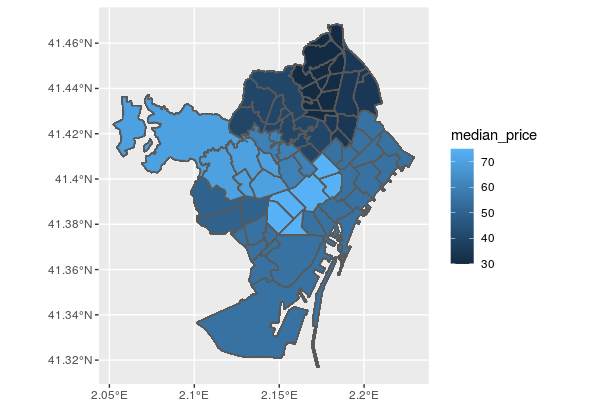
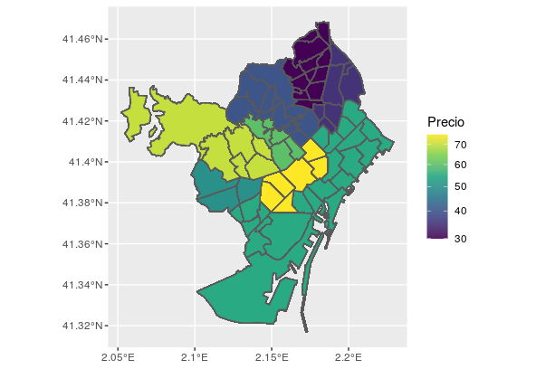

```{r, include = F}
knitr::opts_chunk$set(fig.width = 6, message = FALSE, warning = FALSE, comment = "", cache = FALSE, fig.retina = 3)
library(flipbookr)
library(tidyverse)
library(flair)
library(kableExtra)
```
```{r xaringan-themer, include=FALSE, warning=FALSE}
library(xaringanthemer)
style_duo_accent(
  #base_color = "#43a2ca",
  header_font_google = google_font("Mukta"),#Ubuntu Condensed
  text_font_google   = google_font("Montserrat", "300", "300i"),
  code_font_google   = google_font("Fira Mono"),
  primary_color      = "#0F4C81", # pantone classic blue
  secondary_color    = "#b3e2cd", # pantone baby blue
  #header_font_google = google_font("Raleway"),
  #text_font_google   = google_font("Raleway", "300", "300i"),
  #code_font_google   = google_font("Source Code Pro"),
  text_font_size     = "25px"
#   colors = c(
#   red = "#f34213",
#   purple = "#3e2f5b",
#   orange = "#ff8811",
#   green = "#136f63",
#   white = "#FFFFFF",
# )
)

```

```{r, include=FALSE}
text_spec2 <- function(x = "x"){
  text_spec(x, background = "#b3e2cd", bold = T)
}
```

```{r echo = FALSE}
library(readr) # cargo el paquete
listado <- read_csv("data/listings.csv") #importo los datos
```

# ¿Qué haremos hoy?

- Repaso del taller anterior

- Introducción al paquete ggplot2

- Introducción al paquete sf

---
class: inverse, center, middle
# ggplot2

---
# Gramática de gráficos 

.left-column[


]
.right-column[
 - ggplot2 permite hacer los gráficos por `r text_spec2("capas")`, hay diferentes capas pero `r text_spec2("3 fundamentales")` para hacer el gráficos, es decir, elementos que se van agregando.

 -  `r text_spec2("data")`: el data frame que contiene las variables que vamos a graficar
 
 -  `r text_spec2("aesthetics mapping")`: las variables que vamos a graficar y donde (x, y)
 
 -  `r text_spec2("geometrics")`: el tipo de gráfico que haremos (puntos, líneas, barras, etc.)
 
 -  capas adicionales para mejorar el gráfico (título, etiqueta, nombres de ejes, etc.)
 
]

---
# Capas


| Elemento      | Descripción          | Función | 
|---------------|:-------------:|:------:|
|Data |Set de datos a plotear | ggplot() |
|Aesthetics | Escalas en la que mapearemos los datos | aes() |
|Geometries | Los elementos visuales utilizados para nuestros datos| geom_*() |
|Facets  | Para ploteos múltiples| facet_*() |
|Statistics  | Construye nuevas variables (count, density, etc.)| stat_*() |
|Scales | Que elementos serán mapeados para las variables definidas | scale_*()
|Coordinate | Cartesianas o polares | coord_*() |
|Themes  | Estilos gráficos | theme_*()|


[R graph gallery](https://www.r-graph-gallery.com/portfolio/ggplot2-package/)

---
# Capas


- Las 3 primeras capas deben ser en este orden: `data`, `aesthetics`, `geometry`
--

-  Las capas se van superponiendo con un `+`
--

- La estructura básica es como esta:

`r text_spec2("ggplot")`(data = `r text_spec2("<df>")`) +

   `r text_spec2("aes")`(x = `r text_spec2("<Variable_1>")`, y = `r text_spec2("<Variable_2>")`) +
   
   `r text_spec2("geom_bar")`()  

---
class: inverse, center, middle
# ggplot2::geom_point()

---
# Ejemplo mínimo: data + aes

.pull-left[
```{r eval = FALSE}
# Cargo los paquetes y los datos 
library(ggplot2)
load("data/listado.Rdata")

ggplot(data = listado) +
  aes(x = review_scores_rating, 
      y = price)
```

]
.pull-right[
```{r echo=FALSE}
# Cargo los paquetes y los datos 
library(ggplot2)
load("data/listado.Rdata")

ggplot(data = listado) + #<<
  aes(x = review_scores_rating, #<<
      y = price) #<<
```

]


<!-- http://r-statistics.co/Complete-Ggplot2-Tutorial-Part1-With-R-Code.html -->

---
# Ejemplo mínimo: data + aes + geom


.pull-left[
```{r eval = FALSE}
ggplot(data = listado) +
  aes(x = review_scores_rating, 
      y = price) +
  geom_point() #<<
```

]
.pull-right[
```{r echo=FALSE}
ggplot(data = listado) +
  aes(x = review_scores_rating, 
      y = price)  +
  geom_point() 
```

]

---
# Ejemplo mínimo: Color y transparencia

.pull-left[
```{r eval = FALSE}
ggplot(data = listado) +
  aes(x = review_scores_rating, 
      y = price) +
  geom_point(color = "purple", #<<
             alpha = 0.7)  #<<
```

]
.pull-right[
```{r echo=FALSE}
ggplot(data = listado) +
  aes(x = review_scores_rating, 
      y = price)  +
  geom_point(color = "purple",
             alpha = 0.7) 
```
]
---
# Un error común

.pull-left[
```{r eval = FALSE}
ggplot(data = listado) +
  aes(x = review_scores_rating, 
      y = price,
      color = "purple")  + #<<
  geom_point() 
```

- En aes se definen los parámetros estéticos de las variables.

- Aquellos que son fijos como color = "read", fill = "blue", etc. se escriben afuera de aes().
]
.pull-right[
```{r echo=FALSE}
ggplot(data = listado) +
  aes(x = review_scores_rating, 
      y = price,
      color = "purple")  + 
  geom_point() 
```
]

---
# Tamaño de los puntos

.pull-left[
```{r eval = FALSE}
listado %>%
  filter(!is.na(review_scores_rating)) %>%
  group_by(review_scores_rating) %>%
  summarize(median_price = median(price),
            cantidad = n()) %>% #<<
  ggplot() + 
    aes(x = review_scores_rating,
        y = median_price,
        size = cantidad) +  #<<
    geom_point(color = "purple",
               alpha = 0.7) 
```

]
.pull-right[
```{r echo = FALSE}
listado %>%
  filter(!is.na(review_scores_rating)) %>%
  group_by(review_scores_rating) %>%
  summarize(median_price = median(price),
            cantidad = n()) %>% 
  ggplot() + 
    aes(x = review_scores_rating,
        y = median_price,
        size = cantidad) + 
    geom_point(color = "purple",
               alpha = 0.7) 
```
]

---
# Agrego nombre a ejes y título

.pull-left[

```{r eval=FALSE}
listado %>%
  filter(!is.na(review_scores_rating)) %>%
  group_by(review_scores_rating) %>%
  summarize(median_price = median(price)) %>% #BREAK
  ggplot() + #BREAK
    aes(x = review_scores_rating,
        y = median_price) +  #BREAK
    geom_point(color = "purple",
               alpha = 0.7) +
    labs(x = 'Puntaje', #<<
         y = 'Precio mediano',#<<
         size = '# Evaluaciones', #<<
         title = 'Precios medianos según puntaje de evaluaciones') #<<
```


]
.pull-right[

```{r echo=FALSE}
listado %>%
  filter(!is.na(review_scores_rating)) %>%
  group_by(review_scores_rating) %>%
  summarize(median_price = median(price)) %>% #BREAK
  ggplot() + #BREAK
    aes(x = review_scores_rating,
        y = median_price) +  #BREAK
    geom_point(color = "purple",
               alpha = 0.7) +
    labs(x = 'Puntaje', 
         y = 'Precio mediano',
         size = '# Evaluaciones',
         title = 'Precios medianos según puntaje de evaluaciones')
```
]

---
class: inverse, center, middle
# ggplot:theme_*()


---
# Temas

- La función theme_*() controla el estilo del gráfico, permite definir el color de fondo, la apariencia de la leyenda, tamaños de letra, etc.

- Vienen predefinidos una variedad de temas pero también se puede instalar un paquete con más temas ggthemes.

- Explorar otros [temas](https://ggplot2.tidyverse.org/reference/ggtheme.html).

- Cambiamos el fondo a color blanco al elegir el tema 'bw'

---
# 

.pull-left[
```{r eval = FALSE}
# Cambio de tema
listado %>%
  filter(!is.na(review_scores_rating)) %>%
  group_by(review_scores_rating) %>%
  summarize(median_price = median(price),
            cantidad = n()) %>% 
  ggplot() + 
    aes(x = review_scores_rating,
        y = median_price,
        size = cantidad) + 
    geom_point(color = "purple",
               alpha = 0.7) +
    labs(x = 'Puntaje',
         y = 'Precio mediano',
         size = '# Evaluaciones',
         title = 'Precios medianos según puntaje de evaluaciones') +
    theme_bw() #<<
```

]
.pull-right[
```{r echo = FALSE}
listado %>%
  filter(!is.na(review_scores_rating)) %>%
  group_by(review_scores_rating) %>%
  summarize(median_price = median(price),
            cantidad = n()) %>% 
  ggplot() + 
    aes(x = review_scores_rating,
        y = median_price,
        size = cantidad) + 
    geom_point(color = "purple",
               alpha = 0.7) +
    labs(x = 'Puntaje',
         y = 'Precio mediano',
         size = '# Evaluaciones',
         title = 'Precios medianos según puntaje de evaluaciones') +
    theme_bw() 
```

]
---
# Exportar un gráfico

Es preferible el formato pdf ya que se guarda en formato vectorial y así evitamos que se pixele como puede ocurrir con los formatos png, jpg, etc.

```{r eval=FALSE}
ggsave('precio_puntaje.pdf')
```

Podemos definir otros argumentos para variar el tamaño del gráfico, entre otras cosas. Para guardarlo en png cambiamos pdf por png.

---
# Ejercicio

- Al gráfico anterior agregarle facetas por la variable room_type. Ver ?facet_wrap

- Notar cómo están generadas las variables median_price y cantidad y cambiar lo necesario.

- Guardarlo en formato png

---
# Otras geometrías

Creamos un nuevo objeto nb que contiene la mediana de precios para cada barrio.

```{r}
nb <- listado %>%
  group_by(neighbourhood_group) %>%
  summarise(median_price = median(price))
```

---
class: inverse, center, middle
# ggplot::geom_bar()

---
# Gráfico de barras

.pull-left[
```{r eval = FALSE}
nb %>%
  ggplot(aes(x = neighbourhood_group,  y = median_price)) +
  geom_bar(stat = 'identity') #<<
```

- También podemos escribir la función aes() dentro de ggplot()

- El argumento de geom_bar(), stat='identity', indica que la altura de la barra debe ser igual al valor y.

]
.pull-right[
```{r echo = FALSE}
nb %>%
  ggplot(aes(x = neighbourhood_group,  y = median_price)) +
  geom_bar(stat = 'identity') #<<
```

]


---
# Propiedades del texto del eje x

.pull-left[
```{r eval=FALSE}
nb %>%
  ggplot(aes(x = neighbourhood_group, y = median_price)) +
  geom_bar(stat = 'identity') +
  theme(axis.text.x = element_text(angle = 60, hjust = 1)) #<<
```

La función element_text() la llamo dentro de theme(), debo especificar a que elemento de texto quiero modificar: axis.text.x.

]

.pull-right[
```{r echo=FALSE}
nb %>%
  ggplot(aes(x = neighbourhood_group, y = median_price)) +
  geom_bar(stat = 'identity') +
  theme(axis.text.x = element_text(angle = 60, hjust = 1)) #<<
```
]

---
# Reordeno las categorías de menor a mayor

.pull-left[
```{r eval = FALSE}
nb %>%
  ggplot(aes(x = reorder(neighbourhood_group, -median_price), y = median_price)) + #<<
  geom_bar(fill = 'purple', alpha = .7, stat = 'identity') +
  theme(axis.text.x = element_text(angle = 60, hjust = 1)) +
  labs(x = '', y = 'Precio mediano', title = 'Precio mediano diario por barrio')
```
- La función reorder() reordena las categorías de una variable según los valores de una variable numérica.
]
.pull-right[
```{r echo = FALSE}
nb %>%
  ggplot(aes(x = reorder(neighbourhood_group, -median_price), y = median_price)) +
  geom_bar(fill = 'purple', alpha = .7, stat = 'identity') +
  theme(axis.text.x = element_text(angle = 60, hjust = 1)) +
  labs(x = '', y = 'Precio mediano', title = 'Precio mediano diario por barrio')
```

]

---
class: inverse, center, middle
# sf

---
# GDS (Geographical Data Science)

- R no es un SIG (Sistemas de Información Geográficos). ¿Conocen gvSIG, Qgis, etc.?
<br><br>
--

- R permite hacer Ciencia de Datos Geográficos (SDG)
<br><br>
--

<br><br>

| Atributos     | SIG | SDG |
|---------------|:-------------:|:-------------:|
|Disciplinas | Geografía | Geografía, Computación, Estadística|
| Foco | Interfaz Gráfica | Código |
| Reproducibilidad | Mínimo | Máximo |

---
# Paquetes

- sp, [sf](https://r-spatial.github.io/sf/): para manejar información espacial vectorial
<br><br>
--

- raster: para trabajar con rasters
<br><br>
--

- ggplot2, rasterVis, tmap, leaflet, o mapview: para visualizar información espacial
<br><br>
--

- Es sencillo conectar R con programas SIG: GRASS GIS (rgrass7), SAGA (RSAGA), QGIS (RQGIS y qgisremote), incluso ArcGIS (arcgisbinding).

- [Proyecciones](https://www.youtube.com/watch?v=kIID5FDi2JQ)

---
# sf 
.pull-left[
Combina las funcionalidades de 3 paquetes: **sp**, **rgeos** y **rgdal**
<br><br>

Ventajas respecto a otros paquetes: 
<br><br>

Mayor **velocidad** para importar y exportar los datos
<br><br>

Más tipos de **geometrías** soportadas
<br><br>

**Compatibilidad** con tidyverse. Funciona el pipe!
<br><br>

]
.pull-rigth[
El paquete **sp** es predecesor de sf.
<br><br>

Muchos paquetes espaciales de R todavía dependen del paquete sp, por lo tanto, es importante saber cómo **convertir**.
<br><br>

Convertir objetos  **sf** a **sp**

```{r eval=FALSE}
# Para transformar de SF a SP
objeto.sp <- as(<objeto.sf>, "Spatial")
```

Convertir objetos  **sp** a **sf**

```{r eval=FALSE}
# Para transformar de SP a SF
objeto.sf <- st_as_sf(<objeto.sp>)
```

]

---
# st_read()

- Los objetos sf tienen una clase que combina **'data.frame'** y **'sf'** 
<br><br>
--

- Los objetos sf también tienen una columna especial que contiene los datos de geometría, usualmente llamado 'geom' o **'geometry'**.
<br><br>
--

- Las funciones del paquete **dplyr** se pueden aplicar. Para saber la totalidad de funciones que son aplicables a un objeto de **clase 'sf'** consultar **methods()**.
<br><br>
--

- Para la unión de objetos espaciales se usa **st_join(x, y)**. El método de join utilizado es siempre left join, manteniendo los registros del primer atributo.


---
# ¿De dónde obtenemos las capas con información geográfica?

- Dependiendo del país, será la institución oficial que las provea.

- En Uruguay una gran cantidad de información encontrarán en IDE.

- Un paquete de R para trabajar con datos de Uruguay es [geouy](https://github.com/RichDeto/geouy/)

- Los datos de Barcelona venían en el conjunto de datos abiertos de insideAirbnb.

---
# Importar la información geográfica

```{r eval = FALSE}
# cargo paquete
library(sf)

# importo shapes
barrios <- st_read("data/neighbourhoods.geojson", stringsAsFactors = FALSE)

# consulto clase
class(barrios)

```
```{r eval=FALSE}
# consulto métodos
methods(class = "sf") 
```
```{r echo = FALSE, message= FALSE, include=FALSE}
library(sf)

# importo shapes
barrios <- st_read("data/neighbourhoods.geojson", stringsAsFactors = FALSE)

# consulto clase
class(barrios)

```


---
# Mapa de coropletas

- [Buenas prácticas](https://blog.datawrapper.de/choroplethmaps/) 
<br><br>
--

- Es un **mapa temático** en el que las regiones se colorean de un motivo que muestra una **medida estadística**.
<br><br>
--

```{r}
# cargo datos
load("data/listado.Rdata")
```


---
# ggplot2 + sf

```{r}
# cuento la cantidad de alojamientos por barrios
library(dplyr)
bn <- listado %>%
  group_by(neighbourhood_group) %>% 
  mutate(median_price = median(price)) %>% 
  ungroup()

# uno barcelona con el objeto espacial barrios
barrios <- left_join(barrios, bn, by = "neighbourhood_group")
```

---
class: inverse, center, middle
# ggplot::geom_sf()

---
# ggplot2 + sf
  
.pull-left[
```{r eval = FALSE}  
library(ggplot2)
m <- barrios %>% 
      ggplot() +
  # Defino la geometría
      geom_sf(aes(fill = median_price)) 

```

]

.pull-right[

]


---
class: inverse, center, middle
# ggplot::scale_*()

---
# Cambio escala de colores

.pull-left[
```{r eval = FALSE}
m <- barrios %>% 
      ggplot() +
      geom_sf(aes(fill = median_price)) + # Defino la geometría
      scale_fill_viridis_c("Precio", option = "D", trans = "sqrt", alpha = .9) 
```

]

.pull-right[

]

---
class: middle, center, inverse
# ggsn

---
# Norte y escala

.pull-left[
```{r eval = FALSE}  
m <- barrios %>% 
      ggplot() +
      geom_sf(aes(fill = median_price)) + # Defino la geometría
      scale_fill_viridis_c("Precio", option = "D", trans = "sqrt", alpha = .9) + 
      ggtitle("Precio mediano por barrio") +
      ggsnh::north(barrios,
                  location = "topleft",
                  symbol = 3)  +
     ggsn::scalebar(barrios,
                    dist = 50,
                    dist_unit = "km",
                    transform = F,
                    model = "WGS84")
    
```
]

.pull-right[
```{r echo= FALSE, eval = FALSE}  
m <- barrios %>% 
      ggplot() +
      geom_sf(aes(fill = median_price)) + # Defino la geometría
      scale_fill_viridis_c("Precio", option = "D", trans = "sqrt", alpha = .9) + 
      ggtitle("Precio mediano por barrio") +
      ggsn::north(barrios,
                  location = "bottomleft",
                  symbol = 3)  +
     ggsn::scalebar(barrios,
                    dist = 50,
                    dist_unit = "km",
                    transform = F,
                    model = "WGS84")
    
```
]